# LocalIQ — Comprehensive Technical Architecture & Engineering Diagrams

This document contains the complete set of architectural, system, infrastructure, data model (EER), algorithmic, and operational diagrams for the **LocalIQ Intelligent Local Discovery & Experience Platform**.

All diagrams are authored in standard [Mermaid.js](https://mermaid.js.org/) syntax with strict adherence to system implementation details found in the codebase.

---

## Table of Contents
1. [System Context & Container Architecture (C4 Level 1 & 2)](#1-system-context--container-architecture-c4-level-1--2)
2. [Infrastructure & Network Topology](#2-infrastructure--network-topology)
3. [Kubernetes Production Deployment Topology](#3-kubernetes-production-deployment-topology)
4. [Complete Enhanced Entity-Relationship (EER) Diagram](#4-complete-enhanced-entity-relationship-eer-diagram)
5. [Recommendation Engine & Feasibility Pipeline](#5-recommendation-engine--feasibility-pipeline)
6. [AI Travel Buddy / Agentic Execution Loop](#6-ai-travel-buddy--agentic-execution-loop)
7. [Discovery & Web Scraper Pipeline (SearXNG + LLM)](#7-discovery--web-scraper-pipeline-searxng--llm)
8. [Guide Marketplace & Trip Lifecycle State Machine](#8-guide-marketplace--trip-lifecycle-state-machine)
9. [Group Decision Consensus Engine (Borda Voting)](#9-group-decision-consensus-engine-borda-voting)
10. [Frontend (Flutter) Clean Architecture](#10-frontend-flutter-clean-architecture)
11. [CI/CD Pipeline (Jenkins Automation)](#11-cicd-pipeline-jenkins-automation)
12. [Security, Auth & Threat Model](#12-security-auth--threat-model)

---

## 1. System Context & Container Architecture (C4 Level 1 & 2)

LocalIQ connects travellers, local guides, and curators through a single ingress gateway, orchestrating self-hosted models, relational/vector databases, and external contextual APIs.

```mermaid
flowchart TB
    subgraph Clients["Client Applications"]
        F_WEB["Flutter Web Client\n(Browser SPA)"]
        F_MOB["Flutter Mobile App\n(iOS & Android)"]
        LEG_WEB["Legacy Web Client\n(Next.js Dev Reference)"]
        EXT_DEV["Developer / Teammate\n(API & Shared LLM Client)"]
    end

    subgraph Edge["Edge Layer (Public Ingress)"]
        CF["Cloudflare Edge Network\n(TLS Termination / DDoS Protection)"]
        CFT["cloudflared Tunnel Daemon\n(localiq.tavesglobal.com)"]
    end

    subgraph Gateway["Gateway & Ingress Layer (:8080)"]
        CADDY["Caddy v2 Edge Reverse Proxy\n- Gzip & Zstd compression\n- Route splitting"]
        NGINX["nginx:1.27-alpine\n(Static Flutter SPA Bundle Host)"]
        KONG["Kong 3.9 API Gateway (DB-less)\n- /api/v1/* Routing\n- /llm/* Key-Auth Plugin"]
    end

    subgraph Backend_Layer["Application Core"]
        FASTAPI["FastAPI 0.115+ Backend Application\n(Python 3.12, Uvicorn, Non-Root)"]
        
        subgraph Internal_Services["Application Services"]
            REC_SRV["Recommender Service\n(Feasibility + Ranking)"]
            SEM_SRV["Semantic Search Service\n(Vector Similarity)"]
            LLM_SRV["LLM & Agent Service\n(ReAct Travel Buddy)"]
            DISC_SRV["Discovery Pipeline\n(SearXNG Scraper + LLM)"]
            GUIDE_SRV["Guide Marketplace & Ops\n(Booking & Driver GPS)"]
            TASTE_SRV["Personalization & Taste Engine\n(Implicit/Explicit Signals)"]
            RIGHT_SRV["Right-Now Live Context Engine\n(Weather + Density + Time)"]
        end
    end

    subgraph Storage_Layer["Data & Persistence Layer"]
        PG[("PostgreSQL 16 + pgvector\n(36 Relational Tables +\n768-dim Vector Embeddings)")]
        S3[("Adobe S3Mock / MinIO\n(Object Store for Media & IDs)")]
    end

    subgraph AI_Engines["AI & Inference Engines"]
        OLLAMA["Local Ollama Daemon\n(Llama 3.2:3b / Qwen 2.5:7b\nNomic-embed-text)"]
        GROQ["Groq Cloud API (Optional)\n(Llama-3.3-70b-versatile)"]
        SEARXNG["SearXNG Meta-Search Engine\n(Self-Hosted Privacy Search)"]
    end

    subgraph External_APIs["External Context Providers"]
        METEO["Open-Meteo API\n(Real-Time Mumbai Weather)"]
        GMAPS["Google Maps Platform\n(Places API & Routes API)"]
        RESEND["Resend Email API\n(Transaction & Verification Mails)"]
    end

    %% Client traffic
    F_WEB -->|HTTPS| CF
    F_MOB -->|HTTPS| CF
    LEG_WEB -->|HTTP| CADDY
    EXT_DEV -->|"HTTPS (apikey)"| CF
    CF --> CFT
    CFT --> CADDY

    %% Caddy Routing
    CADDY -->|"Root / (Default)"| NGINX
    CADDY -->|"/api/*"| KONG
    CADDY -->|"/llm/*"| KONG
    CADDY -->|"/docs, /redoc, /readyz"| FASTAPI
    CADDY -->|"/static/*, /media/*"| FASTAPI

    %% Kong Routing
    KONG -->|"Reverse Proxy /api/*"| FASTAPI
    KONG -->|"Key-Auth Protected /llm/*"| OLLAMA

    %% Backend Connections
    FASTAPI --> REC_SRV
    FASTAPI --> SEM_SRV
    FASTAPI --> LLM_SRV
    FASTAPI --> DISC_SRV
    FASTAPI --> GUIDE_SRV
    FASTAPI --> TASTE_SRV
    FASTAPI --> RIGHT_SRV

    FASTAPI -->|psycopg2 / SQLModel| PG
    FASTAPI -->|boto3 S3 API| S3
    FASTAPI -->|HTTP REST| OLLAMA
    FASTAPI -.->|Fallback / Hosted| GROQ
    FASTAPI -->|HTTP JSON API| SEARXNG
    FASTAPI -->|REST API| METEO
    FASTAPI -->|SDK| GMAPS
    FASTAPI -->|REST API| RESEND
```

---

## 2. Infrastructure & Network Topology

This diagram details the Docker Compose network architecture, container resource caps, volume bindings, and inter-service dependencies.

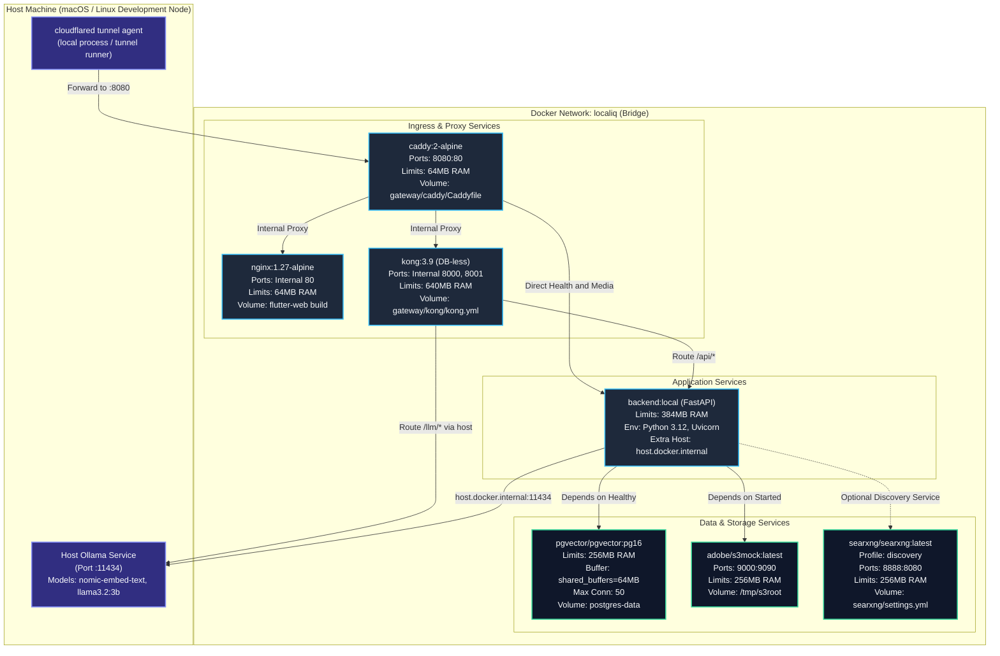

---

## 3. Kubernetes Production Deployment Topology

The production-grade Kubernetes topology featuring the `localiq` namespace, persistent volume claims, secret bindings, and Horizontal Pod Autoscaler (HPA) targeting backend services.

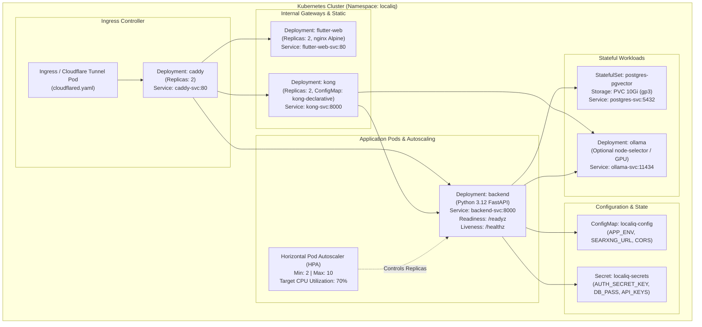

---

## 4. Complete Enhanced Entity-Relationship (EER) Diagram

This diagram displays all **36 database models** across `models.py` and `models_prd.py`, their primary keys, foreign key references, and relationship cardinalities.

```mermaid
erDiagram
    %% Core Domain
    USER ||--o{ USER_SESSION : "has"
    USER ||--o{ EMAIL_VERIFICATION_TOKEN : "issues"
    USER ||--o{ NOTIFICATION : "receives"
    USER ||--o| USER_PROFILE : "profile"
    USER ||--o| EXPERIENCE_WALLET : "owns"
    USER ||--o{ EXPERIENCE_LOG : "logs"
    USER ||--o{ USER_BADGE : "earns"
    USER ||--o| USER_PROGRESS : "tracks"
    USER ||--o{ FAVORITE : "saves"
    USER ||--o{ ITINERARY : "creates"
    USER ||--o{ RECOMMENDATION_FEEDBACK : "submits"
    USER ||--o{ PREFERENCE_SIGNAL : "emits"
    USER ||--o{ USER_ACTIVITY_INTERACTION : "performs"
    USER ||--o{ CONVERSATION_SESSION : "holds"
    USER ||--o{ CONVERSATION : "participates"
    USER ||--o{ AGENT_RUN : "executes"
    USER ||--o{ ONBOARDING_SESSION : "completes"
    USER ||--o{ GROUP : "owns"
    USER ||--o{ GROUP_MEMBER : "joins"
    USER ||--o{ GROUP_VOTE : "votes"
    USER ||--o{ MEETUP_REQUEST : "requests"
    USER ||--o{ MEETUP_REVIEW : "reviews"
    USER ||--o{ MEETUP_BLOCK : "blocks"
    USER ||--o{ PACKAGE_BOOKING : "books"
    USER ||--o{ PACKAGE_REVIEW : "authors"
    USER ||--o{ GUIDE_BOOKING : "reserves"
    USER ||--o{ GUIDE_REVIEW : "rates"

    %% Experience & Guide Domain
    EXPERIENCE ||--o{ GUIDE : "associated_with"
    EXPERIENCE ||--o{ EXPERIENCE_TAG : "classified_by"
    EXPERIENCE ||--o{ ITINERARY_STOP : "included_in"
    EXPERIENCE ||--o{ FAVORITE : "saved_in"
    EXPERIENCE ||--o{ RECOMMENDATION_FEEDBACK : "rated_by"
    EXPERIENCE ||--o{ GUIDE_PACKAGE_STOP : "segment_of"
    EXPERIENCE ||--o{ AI_TIP : "has_tips"
    EXPERIENCE ||--o{ QUEST_STOP : "checkpoint_in"
    EXPERIENCE ||--o{ EXPERIENCE_LOG : "logged_in"
    EXPERIENCE ||--o{ EXPERIENCE_SESSION : "guided_in"

    TAG ||--o{ EXPERIENCE_TAG : "attached_to"
    USER_PROFILE ||--o{ USER_INTEREST : "contains"
    ITINERARY ||--o{ ITINERARY_STOP : "sequences"
    CONVERSATION ||--o{ MESSAGE : "contains"
    CONVERSATION ||--o{ AGENT_RUN : "triggers"

    %% Guide Marketplace
    GUIDE ||--o| GUIDE_PROFILE : "has_profile"
    GUIDE ||--o{ GUIDE_AVAILABILITY : "publishes"
    GUIDE ||--o{ GUIDE_PACKAGE : "offers"
    GUIDE ||--o{ PACKAGE_BOOKING : "accepts"
    GUIDE ||--o{ PACKAGE_REVIEW : "receives"
    GUIDE ||--o{ GUIDE_BOOKING : "fulfills"
    GUIDE ||--o{ GUIDE_REVIEW : "receives_reviews"
    GUIDE ||--o{ GUIDE_TRAINING : "undergoes"
    GUIDE_PACKAGE ||--o{ GUIDE_PACKAGE_STOP : "routes"
    GUIDE_PACKAGE ||--o{ PACKAGE_BOOKING : "booked_as"
    GUIDE_AVAILABILITY ||--o{ GUIDE_BOOKING : "reserves_slot"

    %% Discovery Domain
    DISCOVERY_SOURCE ||--o{ CANDIDATE_CITATION : "cites"
    SCRAPED_CANDIDATE ||--o{ CANDIDATE_CITATION : "mentions"
    SOURCE ||--o{ HIDDEN_GEM_CANDIDATE : "sources"

    %% Social & Groups
    GROUP ||--o{ GROUP_MEMBER : "members"
    GROUP ||--o{ GROUP_OPTION : "options"
    GROUP ||--o{ GROUP_VOTE : "votes"
    GROUP_OPTION ||--o{ GROUP_VOTE : "receives_votes"
    MEETUP_REQUEST ||--o{ MEETUP_MATCH : "forms"
    MEETUP_MATCH ||--o{ MEETUP_REVIEW : "generates"

    %% Quests & Gamification
    QUEST ||--o{ QUEST_STOP : "composed_of"
    QUEST ||--o{ QUEST_RUN : "played_in"
    BADGE ||--o{ USER_BADGE : "cataloged_as"

    %% Entity Details
    USER {
        int id PK
        string email UK
        string password_hash
        string trust_tier "basic, standard, trusted"
        string tier "free, plus, pro"
        string home_city
        json taste_profile_vector
        datetime created_at
        datetime updated_at
    }

    EXPERIENCE {
        int id PK
        string name
        string category
        float lat
        float lng
        int avg_cost
        int duration_min
        string open_time
        string close_time
        float rating
        float local_gem_score
        vector embedding
        json tags
        json accessibility_flags
        json right_now_context_json
        float right_now_score
    }

    TAG {
        int id PK
        string name UK
        string category
        string facet_type "user_facing, internal, composite"
        float weight
    }

    EXPERIENCE_TAG {
        int id PK
        int experience_id FK
        int tag_id FK
        float confidence
        string source
    }

    GUIDE {
        int id PK
        int experience_id FK
        string name
        int rate_per_hour
        float rating
        string verification_status
        json languages
    }

    GUIDE_PACKAGE {
        int id PK
        int guide_id FK
        string title
        string pickup_type
        float total_duration_hours
        int price_per_person
        json inclusions
    }

    PACKAGE_BOOKING {
        int id PK
        string booking_ref UK
        int user_id FK
        int guide_id FK
        int package_id FK
        string status "requested, accepted, confirmed, completed, cancelled"
        float driver_lat
        float driver_lng
        datetime driver_updated_at
    }

    ITINERARY {
        int id PK
        int user_id FK
        string name
        int total_duration_min
        int total_cost
        string share_token UK
    }

    SCRAPED_CANDIDATE {
        int id PK
        string raw_title
        string url
        string area
        json extracted_data
        float llm_confidence
        string status "pending, approved, rejected"
    }

    QUEST {
        int id PK
        string code UK
        string title
        string difficulty
        int xp_reward
        int estimated_minutes
    }

    GROUP {
        int id PK
        int owner_id FK
        string name
        string status "collecting_preferences, collecting_votes, locked"
        json final_plan
    }
```

---

## 5. Recommendation Engine & Feasibility Pipeline

LocalIQ implements a strict **feasibility-first** algorithmic architecture. No experience is scored or ranked unless it passes all hard real-world constraints.

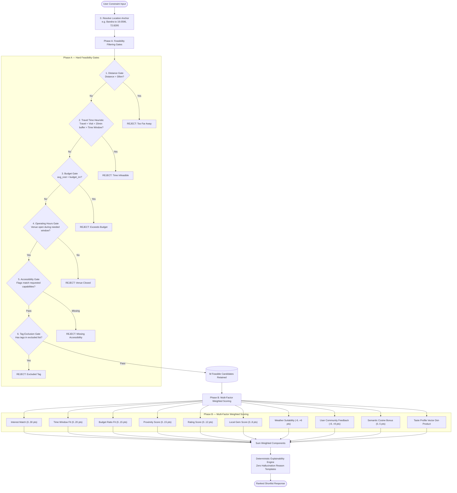

---

## 6. AI Travel Buddy / Agentic Execution Loop

The conversational Travel Buddy operates an agentic ReAct loop (Reasoning + Tool Execution) backed by Ollama (or Groq), persisted in database conversation threads.

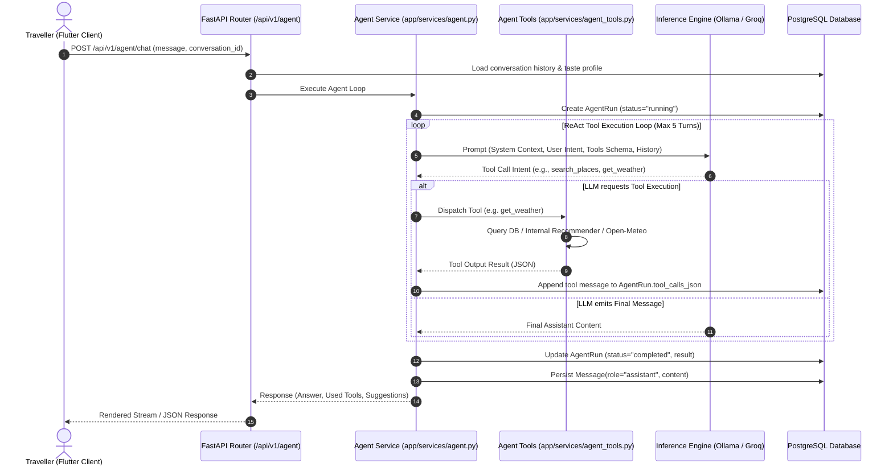

---

## 7. Discovery & Web Scraper Pipeline (SearXNG + LLM)

LocalIQ continuously discovers hidden spots by searching open web resources via SearXNG, scraping pages, extracting structured JSON with local LLMs, and routing candidates to admin moderation.

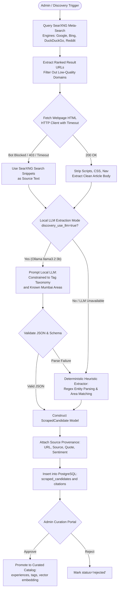

---

## 8. Guide Marketplace & Trip Lifecycle State Machine

A state machine managing guide package bookings, from initial guest request through driver GPS polling to tour completion and verification.

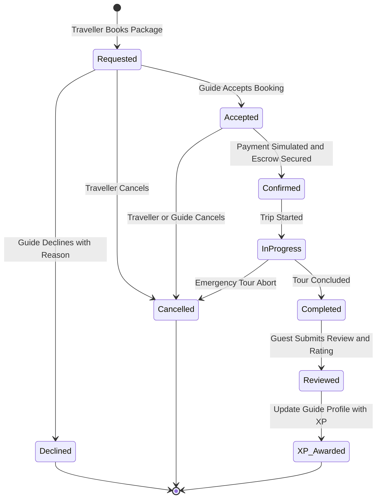

---

## 9. Group Decision Consensus Engine (Borda Voting)

When multiple travellers plan an outing together, LocalIQ resolves divergent preferences using a multi-criteria group decision engine with **Borda Count Ranked-Choice Voting**.

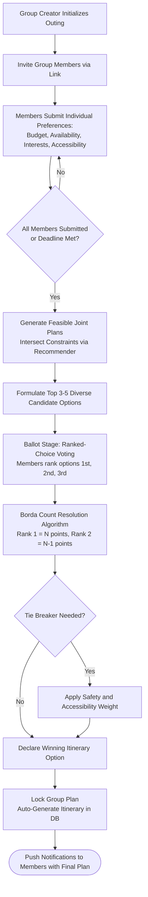

---

## 10. Frontend (Flutter) Clean Architecture

The Flutter client uses a **Feature-Driven Clean Architecture** to support Web, iOS, and Android targets from a unified codebase.

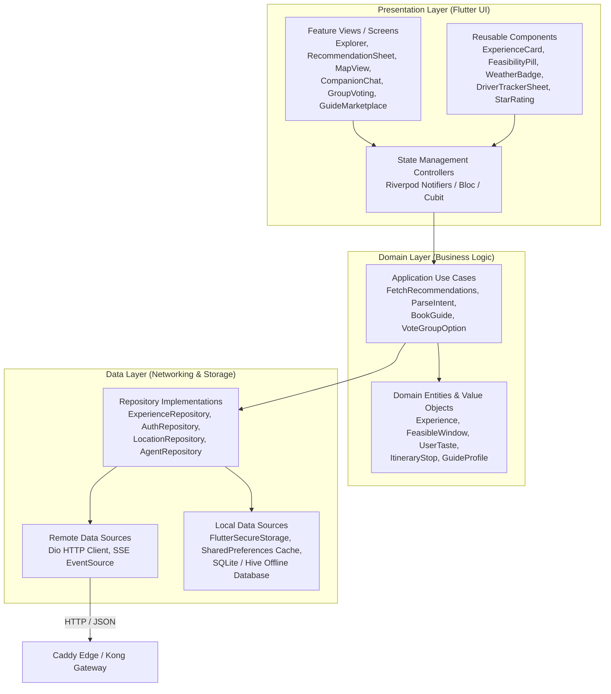

---

## 11. CI/CD Pipeline (Jenkins Automation)

Automated continuous integration pipeline configured via `Jenkinsfile` and Jenkins Configuration as Code (JCasC), enforcing an 80% backend test coverage gate.

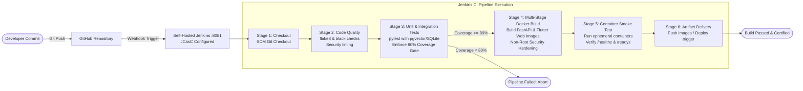

---

## 12. Security, Auth & Threat Model

The multi-layered defence-in-depth model protecting users, database records, and self-hosted AI compute.

```mermaid
flowchart TD
    subgraph Perimeter["1. Perimeter Defence (Public Edge)"]
        CF_IN["Cloudflare Edge\n- DDoS Protection\n- TLS 1.3 Termination\n- Bot Heuristics"]
        TUNNEL["Named Cloudflare Tunnel\n(localiq.tavesglobal.com)"]
    end

    subgraph Edge_Gateway["2. Gateway Security Layer"]
        CADDY_SEC["Caddy Proxy\n- Strict Method & Path Routing\n- Hiding Internal Ports (:8000, :5432, :11434)"]
        KONG_SEC["Kong API Gateway\n- /llm/* Protected by key-auth Plugin\n- IP Rate Limiting (e.g. 100 req/min)"]
    end

    subgraph App_Security["3. Application Security (FastAPI Core)"]
        LOCKOUT["Brute-Force Lockout Middleware\nMax 5 failed logins -> 15 min lock"]
        AUTH_TOK["Session & Token Security\n- PBKDF2-SHA256 Password Hashing\n- Cryptographically Random Tokens\n- Stored ONLY as SHA-256 Hashes in DB"]
        CORS_FILTER["Explicit CORS Allow-List\nNo Wildcards allowed in Production"]
        ERR_MASK["Unified Error Schema\nStack traces masked, no internal leakage"]
    end

    subgraph Data_Security["4. Database & Storage Layer"]
        SQL_PARAM["SQLModel / SQLAlchemy ORM\nStrict Parameterized Queries\n(Zero SQL Injection)"]
        NON_ROOT["Non-Root Container Execution\n(UID 10001, read-only root filesystems)"]
        SECRETS["Secrets-from-File / Environment Isolation\nAUTH_SECRET_KEY validation on boot"]
    end

    CF_IN --> TUNNEL
    TUNNEL --> CADDY_SEC
    CADDY_SEC --> KONG_SEC
    KONG_SEC --> LOCKOUT
    LOCKOUT --> AUTH_TOK
    AUTH_TOK --> CORS_FILTER
    CORS_FILTER --> ERR_MASK
    ERR_MASK --> SQL_PARAM
    SQL_PARAM --> NON_ROOT
    NON_ROOT --> SECRETS
```

---

*Diagrams generated for LocalIQ (Team Nexify · HackCelestial 3.0 · PS-6: Intelligent Local Discovery & Experience Platform).*
